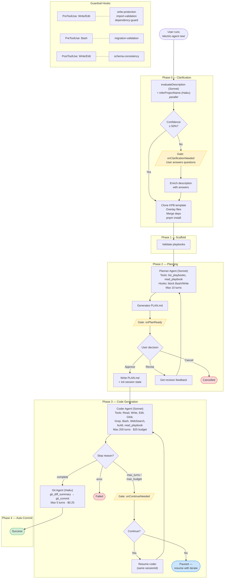

# create-electric-app — Architecture Reference

## Overview

A multi-layered system that takes natural-language descriptions and generates fully functional, reactive Electric SQL + TanStack DB applications. It operates as both a CLI tool (`electric-agent headless`) and a web UI (`electric-agent serve`), using AI agents via the Anthropic Claude Agent SDK to plan, scaffold, and code the target app inside Docker sandboxes.

---

## Entry Points

| Command | File | Purpose |
|---------|------|---------|
| `electric-agent headless` | `src/cli/headless.ts` | NDJSON stdin/stdout protocol, used inside Docker containers |
| `electric-agent headless --stream` | `src/cli/headless.ts` | Durable Stream protocol, used inside Daytona sandboxes |
| `electric-agent serve` | `src/cli/serve.ts` | Starts Hono web server + DurableStream server + React SPA |

Both are registered in `src/index.ts` via Commander.js.

---

## Core Abstractions

### 1. Engine Layer (the heart)

**`OrchestratorCallbacks`** (`src/engine/orchestrator.ts`) — Inverts I/O. The orchestrator never knows if it's running in CLI, web, or test mode:
```
onEvent(event)                    → fire-and-forget event emission
onClarificationNeeded(questions)  → gate: pauses until answers arrive
onPlanReady(plan)                 → gate: pauses until approve/revise/cancel
onRevisionRequested()             → gate: pauses until feedback text
onContinueNeeded()                → gate: pauses until yes/no
```

**`EngineEvent`** (`src/engine/events.ts`) — 18-type discriminated union. Single source of truth for all events:
- Logging: `log`, `user_message`, `assistant_text`, `assistant_thinking`
- Tool tracking: `tool_start`, `tool_result`
- Gates: `clarification_needed`, `plan_ready`, `continue_needed`, `publish_prompt`, `checkpoint_prompt`, `infra_config_prompt`, `repo_setup_prompt`, `gate_resolved`
- Lifecycle: `phase_complete`, `session_complete`, `app_ready`, `cost_update`, `git_checkpoint`

**`sdkMessageToEvents()`** (`src/engine/message-parser.ts`) — Converts raw Claude Agent SDK messages into `EngineEvent[]`.

### 2. Headless Adapters

Two adapters provide the same `readConfig/waitForCommand/callbacks/close` interface but use different transports:

| Adapter | File | Transport | When used |
|---------|------|-----------|-----------|
| Stdin/Stdout | `src/engine/headless-adapter.ts` | NDJSON over stdin/stdout | Docker containers (default) |
| Stream | `src/engine/stream-adapter.ts` | Hosted Durable Stream | Daytona sandboxes (`--stream` flag) |

**Stdin protocol** (controller → agent):
- Line 1 = JSON config `{"command":"new",...}`, Lines 2+ = gate responses or new commands
- Agent → controller: One `EngineEvent` JSON per line (NDJSON)

**Stream protocol** — bidirectional on a single durable stream:
- Server writes: `{ source: "server", type: "command", ... }` or `{ source: "server", type: "gate_response", gate: "...", ... }`
- Agent writes: `{ source: "agent", type: "tool_start", ... }` etc.
- Each side filters messages by `source` field

### 3. Gate Mechanism

Two implementations, same concept — a Promise that blocks until an external event resolves it:

| Context | Implementation | How it resolves |
|---------|---------------|-----------------|
| Headless/container | `StdinReader.waitFor(gateName)` | Matching JSON line arrives on stdin |
| Web server | `createGate(sessionId, gateName)` in `src/web/gate.ts` | `POST /api/sessions/:id/respond` calls `resolveGate()` |

Server-side gates: `checkpoint`, `publish`, `infra_config`, `repo_setup`
Container-forwarded gates: `clarification`, `approval`, `continue`, `revision`

### 4. Durable Streams

Two modes:

| Mode | Config | Stream URL pattern |
|------|--------|--------------------|
| **Local** | `@durable-streams/server` at port 4437 | `http://localhost:4437/session/{id}` |
| **Hosted** | `DS_URL` + `DS_SERVICE_ID` + `DS_SECRET` env vars | `{DS_URL}/v1/stream/{DS_SERVICE_ID}/session/{id}` |

Stream configuration is centralized in `src/web/streams.ts`:
- `getStreamConfig()` reads env vars, returns null if not configured (falls back to local)
- `getStreamConnectionInfo(sessionId)` builds the full URL + auth headers
- `getStreamEnvVars(sessionId)` generates env vars to pass to sandboxes

Enables:
- Real-time push via SSE subscription
- Catch-up on reconnect via offset tracking
- Full session replay after completion

### 5. Session Bridge

**`SessionBridge`** (`src/web/bridge/types.ts`) — Abstracts bidirectional communication between server and sandbox:

```
emit(event)             → write server event to stream
sendCommand(cmd)        → write command to stream
sendGateResponse(gate)  → write gate response to stream
onAgentEvent(cb)        → subscribe to agent events from stream
onComplete(cb)          → fires when session_complete arrives
```

**`HostedStreamBridge`** (`src/web/bridge/hosted.ts`) — Implementation backed by hosted Durable Streams. Both server and sandbox connect to the same stream; messages are tagged with `source: "server"` or `source: "agent"` and each side filters by source.

---

## Agent System

All agents use `query()` from `@anthropic-ai/claude-agent-sdk` with async generators for streaming input.

| Agent | File | Model | Max Turns | Budget | Tools |
|-------|------|-------|-----------|--------|-------|
| **Clarifier** | `src/agents/clarifier.ts` | sonnet (evaluate) / haiku (name) | 1 | — | None |
| **Planner** | `src/agents/planner.ts` | sonnet | 10 | — | `read_playbook`, `list_playbooks`, `WebSearch` |
| **Coder** | `src/agents/coder.ts` | sonnet | 200 | $25.00 | Read/Write/Edit/Glob/Grep/Bash/WebSearch + MCP build/playbooks |
| **Git Agent** | `src/agents/git-agent.ts` | haiku | 5 | $0.25 | 9 git MCP tools |

**Session resumption**: The coder returns a `session_id` from the SDK. Stored in `SessionInfo.lastCoderSessionId` and passed as `{ resume: sessionId }` on subsequent runs, preserving full conversation context.

**System prompts** (`src/agents/prompts.ts`):
- `buildCoderPrompt(projectDir)` — 130-line prompt: Drizzle Workflow order, parallel tool calls, SSR rules, ARCHITECTURE.md format, file edit rules
- `buildPlannerPrompt()` — 6-phase plan structure with exact schema format
- `buildGitAgentPrompt(projectDir)` — Conventional commits + git workflow

---

## Tool System (MCP)

Tools are created with `tool()` from the Agent SDK and grouped into MCP servers via `createSdkMcpServer()`. Referenced as `mcp__<server-name>__<tool-name>` in `allowedTools`.

| Server | File | Tools |
|--------|------|-------|
| `electric-agent-tools` | `src/tools/server.ts` | `build`, `read_playbook`, `list_playbooks` |
| `git-tools` | `src/tools/git-server.ts` | `git_status`, `git_diff_summary`, `git_diff`, `git_commit`, `git_init`, `git_push`, `gh_repo_create`, `gh_pr_create`, `git_checkout` |

**Build tool** (`src/tools/build.ts`): Runs `pnpm build` → `pnpm check` → `pnpm test` sequentially, returns structured `{ success, output, errors }`.

**Playbook tools** (`src/tools/playbook.ts`): Scans npm packages (`@electric-sql/playbook`, `@tanstack/db-playbook`, `@durable-streams/playbook`) + bundled `playbooks/` for SKILL.md files with YAML frontmatter. `validatePlaybooks()` fails fast if required skills are missing.

---

## Hooks System

Hooks intercept Claude Agent SDK tool calls at `PreToolUse` and `PostToolUse` without the agent knowing.

| Hook | File | Stage | What it does |
|------|------|-------|-------------|
| `guardrailInject` | `src/hooks/guardrail-inject.ts` | `SessionStart` | Injects `electric-app-guardrails` + `ARCHITECTURE.md` as XML context |
| `writeProtection` | `src/hooks/write-protection.ts` | `PreToolUse[Write\|Edit]` | Denies writes to config files (docker-compose, vite.config, etc.) |
| `importValidation` | `src/hooks/import-validation.ts` | `PreToolUse[Write\|Edit]` | Blocks hallucinated imports, enforces correct package paths |
| `migrationValidation` | `src/hooks/migration-validation.ts` | `PreToolUse[Bash]` | Auto-appends `REPLICA IDENTITY FULL` to migration SQL |
| `dependencyGuard` | `src/hooks/dependency-guard.ts` | `PreToolUse[Write\|Edit]` | Prevents removal of existing package.json dependencies |
| `schemaConsistency` | `src/hooks/schema-consistency.ts` | `PostToolUse[Write\|Edit]` | Warns on `z.coerce.date()`, wrong zod import, missing `.default()` |
| `blockBash` | Inline in `src/hooks/index.ts` | `PreToolUse[Bash\|Write\|Edit]` | Planner-only: silently denies all file operations |

Hooks return `{ hookSpecificOutput: { permissionDecision: "deny" } }` to block a tool call.

---

## Scaffold System

`scaffold(projectDir, opts)` in `src/scaffold/index.ts` performs 12 steps:

1. Clone KPB template via `npx gitpick KyleAMathews/kpb`
2. Copy `template/` overlay (docker-compose, drizzle config, db stubs, electric proxy)
3. Merge dependencies into package.json (TanStack DB, Electric, Drizzle, drizzle-zod, vitest, etc.)
4. Delete stale pnpm-lock.yaml
5. Patch `vite.config.ts` — configurable port via `VITE_PORT`, `host: true`, proxy for `/v1/shape`
6. Fix public CSS imports (Rollup can't resolve absolute public-dir paths)
7. Copy `.env.example` → `.env`
8. Create `_agent/` working memory directory (errors.md, session.md)
9. Patch `.gitignore`
10. `pnpm install` (falls back to npm)
11. `git init -b main` + initial commit

---

## Web UI Architecture

### Server (`src/web/server.ts`)

Hono REST API with 20+ endpoints. Key patterns:

- **Session creation** is async: returns `{ sessionId, streamUrl }` immediately (201), then launches background flow: wait for infra gate → create Docker sandbox → bridge container stdout → optionally emit `repo_setup_prompt` gate (if GitHub accounts exist) → send "new" command
- **Iterate** detects app lifecycle commands (start/stop/restart) and handles them directly via `sandbox.startApp()`/`stopApp()` without invoking the agent
- **Git operations** (checkpoint/publish/PR) send `{ command: "git", gitTask: "..." }` to the container, letting the git agent handle it inside

### Container Bridge (`src/web/container-bridge.ts`)

Reads container stdout line-by-line, parses as `EngineEvent` JSON, appends to `DurableStream`. Classifies stderr (infra/Vite messages as info, others as error). Detects `VITE v*.* ready` to emit `app_ready`.

### Sandbox Provider (`src/web/sandbox/`)

`SandboxProvider` interface (`src/web/sandbox/types.ts`) abstracts sandbox management as pure CRUD + operations. Communication (commands, gate responses) flows through `SessionBridge`, NOT through the provider.

| Provider | File | Runtime | Communication |
|----------|------|---------|---------------|
| `DockerSandboxProvider` | `src/web/sandbox/docker.ts` | Docker containers | NDJSON stdin/stdout (via `writeStdin()` + container-bridge) |
| `DaytonaSandboxProvider` | `src/web/sandbox/daytona.ts` | Daytona cloud sandboxes | Hosted Durable Stream (via `SessionBridge`) |

**CRUD API** (`/api/sandboxes`):
- `GET /api/sandboxes` — list all active sandboxes
- `GET /api/sandboxes/:sessionId` — get sandbox status
- `POST /api/sandboxes` — create standalone sandbox
- `DELETE /api/sandboxes/:sessionId` — destroy sandbox

**Docker** (`DockerSandboxProvider`):
- **create()**: `findFreePort()` → generate docker-compose.yml → start postgres+electric (local mode) → `docker compose run agent`
- Internal `ChildProcess` stored in private state (not exposed in handle)
- **File access**: `docker exec find/cat`
- **Auth**: tries `ANTHROPIC_API_KEY` → `CLAUDE_CODE_OAUTH_TOKEN` → macOS Keychain

**Daytona** (`DaytonaSandboxProvider`):
- **create()**: `daytona.create({ image, envVars, labels })` → get preview URL
- **File access**: `sandbox.process.executeCommand()` / `sandbox.fs.downloadFile()`
- **Preview**: `sandbox.getPreviewLink(port)` for accessible URLs
- Requires `DAYTONA_API_KEY`, `DAYTONA_API_URL`, `DAYTONA_TARGET` env vars

### React Client (`src/web/client/`)

- **Router**: `/` (HomePage) and `/session/:id` (SessionPage)
- **`useSession()`** hook: subscribes to DurableStream, reduces `EngineEvent` → `ConsoleEntry[]`, tracks `isComplete`, `appReady`, `totalCost`
- **GatePrompt**: Renders different UI per gate type (clarification form, plan markdown, publish form, etc.), all POSTing to `/api/sessions/:id/respond`
- **Layout**: `AppShell` with collapsible sidebar + session list; `SessionPage` with resizable split pane (console left, file tree + viewer right)

---

## Working Memory

| File | Location | Purpose |
|------|----------|---------|
| `session.md` | `<projectDir>/_agent/` | Phase, task, build status — updated at milestones |
| `errors.md` | `<projectDir>/_agent/` | Error log with dedup — coder checks before retrying fixes |

`consecutiveIdenticalFailures()` compares last two errors to trigger escalation.

---

## Complete Data Flow: User → Generated App

```
User types "build a todo app" in browser
  → POST /api/sessions { description }
  → Server creates DurableStream + SessionInfo
  → Emits infra_config_prompt gate → user selects "Local Docker"
  → DockerSandboxProvider.create():
      postgres:17 + electricsql/electric + agent container
  → bridgeContainerToStream(stdout → DurableStream)
  → (if GitHub accounts exist) emit repo_setup_prompt → user configures repo
  → sendCommand({ command: "new", description })
  → Container headlessCommand() reads config from stdin
  → runNew():
      evaluateDescription() → confidence 85% → skip clarification
      scaffold() → clone KPB + overlay + install
      runPlanner() → Sonnet reads playbooks → outputs PLAN.md
      emit plan_ready → user clicks Approve → gate resolves
      runCoder() → Sonnet executes PLAN.md (200 turns):
        hooks auto-fix: REPLICA IDENTITY FULL, import validation
        writes schema → migrations → collections → routes → UI
        runs build tool → passes
        writes ARCHITECTURE.md
      runGitAgent() → Haiku commits: "feat: build todo app"
      emit session_complete
  → Bridge fires onComplete → session status = "complete"
  → Client: toast("Session completed"), Preview button appears
  → User clicks Preview → http://localhost:{mappedPort}
```

---

## Flow Diagram



---

## Key Design Patterns

1. **Callback-driven I/O inversion** — Engine never knows its output target
2. **Dual transport** — NDJSON stdin/stdout for Docker, hosted Durable Stream for cloud sandboxes
3. **Source-tagged bidirectional stream** — Single stream per session, messages tagged `source: "server"` or `source: "agent"`, each side filters by source
4. **SessionBridge abstraction** — Hides transport details; server and sandbox use the same API
5. **Promise-based gates** — Pause workflow until external decision arrives
6. **Durable Streams** — File-backed or hosted event log for replay, catch-up, persistence
7. **Hook interception** — Transparent correctness enforcement without agent awareness
8. **Session resumption** — SDK session IDs preserve full conversation context across runs
9. **Progressive disclosure** — Planner reads playbooks first, coder reads them per-phase as instructed by the plan
10. **Provider-agnostic CRUD** — `SandboxProvider` interface enables Docker/Daytona swap without changing server code
